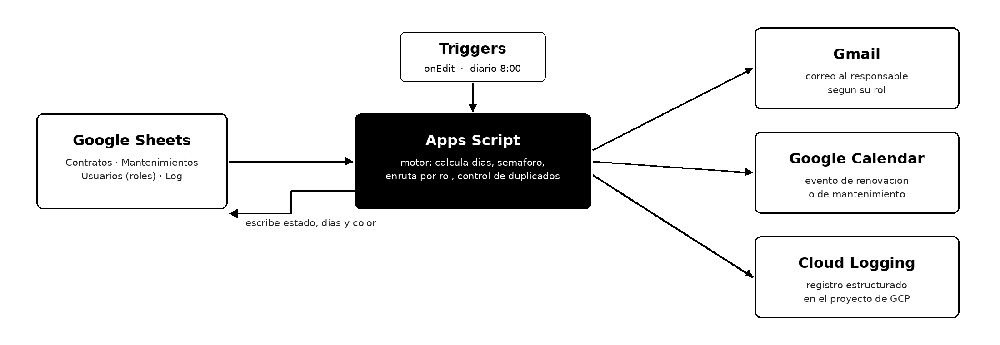

# Día 2 - Automatización en Google Workspace con Apps Script

Sistema de control de renovaciones de contratos y mantenimientos para una
empresa ficticia de renta de equipo de cómputo e impresión (Equipa TI).
Corre sobre Google Sheets, Apps Script, Gmail y Calendar, con registro en
Cloud Logging.

## Qué hace

- Calcula los días que faltan para cada vencimiento de contrato y cada
  servicio de mantenimiento, y pinta la fila con un semáforo.
- Cuando algo entra en ventana de aviso, manda correo al responsable según
  su rol (ejecutivo de cuenta o técnico) y crea el evento en Calendar.
- Manda un resumen diario al gerente comercial y al coordinador de soporte.
- Corre solo con dos triggers: al editar la hoja y todos los días a las 8:00.
- No repite avisos: cada fila guarda si ya se avisó y si ya se creó el evento.
- Registra cada acción en la pestaña Log y en Cloud Logging del proyecto de GCP.

Los destinatarios no están en el código. Se leen de la pestaña Usuarios,
así que cambiar un responsable es editar una celda.

## Archivos

| Archivo | Contenido |
|---|---|
| main.gs | Construye el entorno: 4 pestañas con datos de ejemplo |
| Utilities.gs | Umbrales, cálculo de días, semáforo, lectura de usuarios, registro |
| Contracts.gs | Procesamiento de contratos |
| Maintenance.gs | Procesamiento de mantenimientos |
| Summary.gs | Resúmenes diarios por rol |
| Triggers.gs | Instalación de triggers, rutina diaria y manejador de edición |

## Cómo montarlo

1. Crear una hoja de cálculo en blanco y abrir Extensiones > Apps Script.
2. Crear los seis archivos con el contenido de este repo.
3. En `main.gs` poner el correo base para los alias de prueba.
4. Ejecutar `configurarEntorno` (una sola vez) y autorizar.
5. Ejecutar `instalarTriggers`.
6. Opcional: en Configuración del proyecto, enlazar un proyecto de GCP con
   la API de Cloud Logging habilitada para recibir los logs.

## Pruebas

Ejecutar `procesarContratos` dos veces seguidas: la segunda debe terminar en
"0 avisos enviados". Agregar una fila en Contratos con vencimiento a menos de
30 días: se debe pintar y avisar sola sin ejecutar nada.
